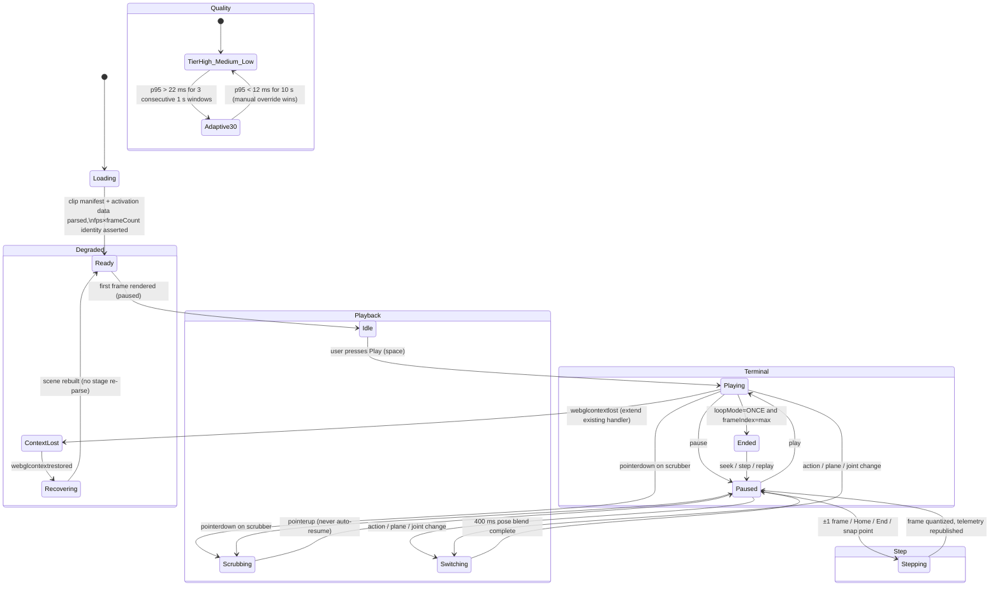
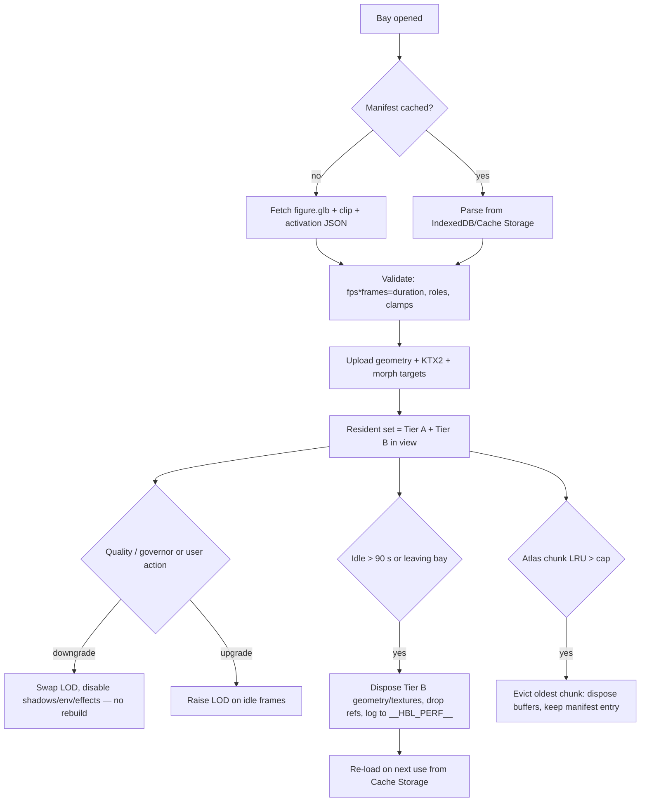

# Movement Theater — Masterplan

**Document type:** Masterplan (design only — no application code, shaders or animation data are written by this deliverable)
**Target:** `sanjib20jgec-arch/Humanbody` @ `10e11df` (branch `arena/01a10393-humanbody`)
**Live site inspected:** https://humanbody-bice.vercel.app/
**Date:** 2026-10-03
**Status:** Awaiting approval — see Gatekeeper at the end.

---

## 0. How to read this document

### 0.1 Pillar → section map

| Pillar | Designed in |
|---|---|
| 1 — Musculoskeletal deformation & fidelity | §4.1 |
| 2 — Temporal controls (timeline & scrubber) | §2.1–§2.5, §3.3 |
| 3 — Agonist/antagonist activation heatmap | §4.3 |
| 4 — Live kinematic telemetry & ROM | §3.4, §2.2 |
| 5 — Kinematic camera & joint isolation | §2.6, §3.5 |
| 6 — Mobile GPU budget & culling | §5 |

### 0.2 Evidence conventions

Every factual claim is tagged:

* **[MEASURED]** — produced by a harness/command run during this audit (method in Appendix A).
* **[SOURCE]** — read directly from repository source at `10e11df`.
* **[INFERRED]** — derived by arithmetic from measured/source values (no speculation).
* **[ASSUMPTION]** — explicitly unverified; must be closed before the affected phase ships.
* **[CITE]** — external literature/reference.

### 0.3 Audit limitations (read this before trusting any FPS number)

The sandbox that produced this audit has **no browser**: `npx playwright install chromium` fails (CDN blocked, exit 1) and `--with-deps` fails (Debian mirrors unreachable). Therefore:

* **No FPS, no GPU timings, no real draw-call counter and no `renderer.info` were measured.** All frame-time and draw-call figures are **[INFERRED]** from static/source facts and are labelled as such.
* Desktop/mobile FPS is stated as a **target and a risk**, never as a measured baseline.
* Closing this gap is task **M1** in Phase 1 (§6) and is a hard dependency for Pillar 6 sign-off.

---

## 1. Executive summary + current-state audit

### 1.1 Executive summary (10 lines)

1. The Movement Theater is a **2,400-line hand-built three.js subsystem** inside a React 19 + Vite app: a 20-action motion registry, 2 CMU-derived BVH clips, a 20-bone procedural **rigid-segment** figure, and a 54-mesh muscle layer.
2. It already ships real domain value — RLA gait phases, joint-angle curves vs. a normative band, muscle origin/insertion facts, provenance badges, and a disclosure culture — but it **plays itself**: 19 of 20 actions loop forever and autoplay is the default.
3. The timeline is **not a source of truth**: the scrubber is an uncontrolled `<input type="range">` that never follows playback, `−1f/+1f` actually steps 3–4 frames, and two independent speed owners disagree (lab 0.5/1/2× vs keyboard 0.25–1×).
4. Kinematics are honest but narrow: **sagittal hip/knee/ankle of the left side only**, calibrated to the clip's frame 0, with an explicit "not ISB" disclaimer.
5. Activation data is **hardcoded JS closures** in `actions.js` (§A12), some actions peak above 1.0 (§A11), and 8 of 20 actions have no curated roles and fall back to a peak-threshold guess.
6. The heat palette **fails a deuteranopia check**: current PM `#ff5d47` vs SY `#ffb347` collapse to `#b2a142` vs `#dfc94a` (ΔE*ab = 19.9, "risky") — and the "activation heat colours" switch is inert (§A9, §A10).
7. The figure costs **80 meshes / 55 materials / 6,184 triangles** — an 80-draw-call figure before props, doubled by dual-view, plus a shadow pass (§A6, §A7). Skeletal CPU cost is trivial (0.057 ms/frame), proving the bottleneck is **GPU state changes, transparency and DOM**, not math.
8. Every visual number is written to the DOM at 60 Hz (3 angle readouts, 6 SVG attributes, 54 meter widths) with per-frame `BufferGeometry` reallocation for 4 trail lines (§A4, §A5).
9. Quality tiers exist (`auto/cinema/fast`) but the fallback **rebuilds the whole stage from scratch: 104 ms of CPU before any GPU work** (§A15), and no budget in `scripts/performance-budgets.json` is asserted at runtime.
10. The plan below converts this into a **time-owned, data-driven, budget-governed simulator** in 4 phases, with the CPU-only wins (Phase 1) front-loaded so students feel the difference before any new asset work lands.

### 1.2 Current-state audit table

Audit IDs are referenced throughout the rest of the document (traceability requirement).

| ID | Area | Finding | Evidence | Impact |
|---|---|---|---|---|
| **A1** | Temporal | Autoplay is the default (`playing = !reducedMotion`), and 19/20 actions have `loop: true` | [SOURCE] `KinesiologyLab.jsx:9`, `actions.js` (inventory run) | No user intent; battery/thermal; un-trustworthy "always moving" feel |
| **A2** | Temporal | Scrubber is uncontrolled (`defaultValue={0}`, `min 0 max 1000`); thumb never follows playback; no time readout; drag does not pause | [SOURCE] `KinesiologyTheater.jsx:1030-1031` | Broken mental model of "where am I in the movement" |
| **A3** | Temporal | `−1f/+1f` advances `duration × frameTime` = 0.133 s (walk) / 0.100 s (jump) = **4 / 3 clip frames**; lab step button = 0.2 s; no ping-pong; no snap points except a walk-only "contact" | [SOURCE] `KinesiologyTheater.jsx:975-977` | "Frame-accurate" claim is false today |
| **A4** | Perf (CPU/DOM) | DOM written every rAF: 3 × `textContent`, 3 × 2 SVG `setAttribute`, 54 × `style.width`, ribbon `style.left`, plus caption `setState` | [SOURCE] `KinesiologyTheater.jsx:500-560, 578-600` | Style/layout thrash on the main thread; janks on mid-tier phones |
| **A5** | Perf (GC) | `geometry.setFromPoints(...)` per frame for CoM line + 3 trails; `new THREE.Color()` per muscle per frame in `setMuscleActivation`/`resetMuscles`; `bone.quaternion.clone()` during mode blends | [SOURCE] `performanceRig.js:170-176`, `KinesiologyTheater.jsx:486-494, 568-576` | GC saw-tooth; hitches at 60 Hz budgets |
| **A6** | Perf (draw) | Figure = **80 meshes / 80 geometries / 55 materials / 6,184 tris / 7,157 verts**; 54 muscle meshes each with a **cloned** material; low tier = 80 meshes / 3,556 tris | [MEASURED] harness | 80 draws per pass for one figure; material mutations per frame |
| **A7** | Perf (passes) | Dual-view renders the scene a 2nd time (≥900 px only); non-low tiers add a 1024² PCF-soft shadow pass with **all** rig meshes casting; 3 directional + 1 spot + hemisphere lights | [SOURCE] `KinesiologyTheater.jsx:232-250, 604-640` | Up to ~3× geometry submission with up to ~250 draw calls [INFERRED] |
| **A8** | Fidelity | Rig is **rigid segments** (cylinders/spheres parented to `Object3D`s). No skinning, no weights, no morph targets, no volume preservation; muscles are straight tapered cylinders | [MEASURED] 20 bones, 0 morphs, 0 skin attributes | Elbows/knees/hips read mechanical; no bulge/elongation story |
| **A9** | A11y/Science | Role palette PM `#ff5d47` / SY `#ffb347` / ST `#4dd8df`; deuteranopia simulation gives min pairwise ΔE*ab = **19.9** (PM/SY) — "risky"; no intensity legend for the 0–1 mapping | [MEASURED] Machado-2009 severity-1.0 simulation | Deuteranopes cannot separate prime mover from synergist |
| **A10** | Correctness | "activation heat colours" and "joint markers" toggles call `rig.setHeatMode` / `rig.setMarkersVisible`, which **do not exist** on the rig (guarded no-ops). The browser spec that asserts them via `__kineDebug` cannot pass | [SOURCE] `KinesiologyTheater.jsx:503-505, 646` vs `performanceRig.js` (183 lines, no such methods) | Two dead switches; suite red |
| **A11** | Data | Activation levels exceed 1.0: `kick` 1.30, `reach-up` 1.20, `bow`/`shrug` 1.10 → `emissiveIntensity` up to 2.08 and meters rendered >100 % | [MEASURED] inventory run over 21 samples/action | Non-physical encoding; unclear legend semantics |
| **A12** | Data | Activation curves are **JS closures** (`activations: (t) => …`) inside `actions.js`; roles curated for 12/20 actions (45 distinct keys); 8 actions derive PM/SY/ST from peaks ≥0.70/≥0.38 | [MEASURED] inventory run | SME cannot review/author without editing code; violates the "external data" requirement |
| **A13** | Camera | Presets are 7 fixed shots (no joint anchoring except `closeup`); damping is a **framerate-dependent lerp** (0.08 / 0.12 / 0.15 / 0.20); no orbit/zoom limits; no reset-view; a single canvas `pointerdown` flips `orbitRef` and only a preset tap returns control | [SOURCE] `cameraDirector.js:39-57`, `KinesiologyTheater.jsx:383, 549` | 120 Hz vs 60 Hz devices behave differently; shaky follow |
| **A14** | Perf/Sorting | Muscle selection flips `material.transparent` + `needsUpdate` per muscle → shader recompile + 54 transparent sorted draws; ghost rig adds 80 more transparent draws when a clinical pattern is on | [SOURCE] `KinesiologyTheater.jsx:677-687, 308-312` | Selection hitch; transparency sort cost |
| **A15** | Perf (startup) | Changing quality tears down and rebuilds the entire scene (`useEffect(…, [reducedMotion, quality])`) including 2 BVH parses + calibration + stance detection + 60-sample angle precompute. **Measured CPU: 104.2 ms** (rig 21.5 ms, clips 76.1 ms, angles 6.7 ms) before any WebGL work | [MEASURED] harness | 200–400 ms freeze on a mid-tier phone CPU [INFERRED ×2–4] |
| **A16** | Governance | `scripts/performance-budgets.json` defines maxDrawCalls 220/160/140 and frameMsP95 22/33/40 but the theater asserts **none** of them; no on-screen FPS/draw-call readout in the theater (the atlas has `?debug` + `window.__HBL_PERF__`) | [SOURCE] `performance-budget.json`, `performance.js` | Regressions ship silently |
| **A18** | Science | Telemetry = sagittal plane, **left side only**, calibrated so clip frame 0 ≈ 0°; module comment states "teaching convention, not ISB"; UI discloses PiG vs CGM2.3 knee-rotation difference ≈ 18° | [SOURCE] `jointAngles.js:1-2, 66-70`; `KinesiologyTheater.jsx:900-905` | Cannot answer "what is *my* right knee doing?" or "is this in the ISB convention?" |
| **A19** | Correctness | Time→frame mapping is duration-based (`floor(tn × frames)`); if a future clip's `duration ≠ frames × frameTime`, playback silently drifts | [SOURCE] `KinesiologyTheater.jsx:432-434` | Fragile contract for new clips |
| **A20** | Lifecycle | No LOD, no per-bay disposal of the atlas chunk cache, no visibility gate when the tab is hidden; the atlas' 31.4 MB gz / 15 chunks stay in the same session | [INFERRED] from `public/models/atlas.json` + source | Memory pressure on 4 GB handsets |
| **P1** | Perf (win) | Skeletal CPU cost is negligible: pose + foot-plant + telemetry math = **0.057 ms/frame** (600-frame loop) | [MEASURED] harness | Budget can be spent on GPU/DOM, not on animation math |
| **P2** | Infra (win) | Device profile tiers (tv/phone/tablet/desktop, `capable`, `lowPower`) and `window.__HBL_PERF__` milestone telemetry already exist | [SOURCE] `deviceProfile.js`, `performance.js` | Reuse instead of rebuild |
| **P3** | Infra (win) | `useTimeline` hook exists (used by `DeepDiveExplorer`) | [SOURCE] `src/lib/useTimeline.js` | Candidate to unify, or to supersede with the new TimeController |
| **P4** | Process (win) | 32 kinesiology browser tests + 41 tests overall; CI runs static + SwiftShader browser contracts | [SOURCE] `tests/browser/`, `.github/workflows/verify.yml` | Guardrails for a refactor, if the dead assertions are fixed first |

### 1.3 Tech stack

| Layer | Version / choice | Evidence |
|---|---|---|
| React / ReactDOM | 19.3.0 | [MEASURED] `package-lock.json` |
| three.js | 0.186.1 (imperative, no R3F) | [MEASURED] |
| State manager | **None** — `useState`/`useRef` + one `PreferencesContext` | [SOURCE] |
| Build | Vite 8.3.1 + `@vitejs/plugin-react`; `vite build --mode offline` for the 48 MB single-file artifact | [MEASURED] build log |
| Language | JavaScript + JSX (no TypeScript) | [SOURCE] |
| Test | Playwright 1.63, projects `chromium-desktop` (1440×1000) + `chromium-phone` (Pixel 5), SwiftShader GL | [SOURCE] `playwright.config.mjs` |
| Deploy | Static `dist/` on Vercel | [ASSUMPTION] from URL + dist output |
| Bundle cost of this bay | `KinesiologyLab` = 297 kB min / **75 kB gz** (lazy); shared `three.module` = 737 kB min / 187 kB gz; app `index` = 345 kB / 106 kB gz; CSS 322 kB | [MEASURED] `vite build` |

### 1.4 Asset inventory

| Asset | Format | Count / size | Notes |
|---|---|---|---|
| Figure | **Procedural primitives** — `CylinderGeometry`, `SphereGeometry`, `BoxGeometry`, `CapsuleGeometry` | 80 meshes, 80 geometries, 55 materials | No GLB/FBX/glTF anywhere in the movement path [MEASURED] |
| Triangles | — | **6,184** (detail 20) / **3,556** (detail 10) | [MEASURED] |
| Vertices | — | 7,157 | [MEASURED] |
| Bones | three `Object3D` nodes | **20** (`root, spine, chest, neck, head, jaw, L/R clavicle→hand, L/R upLeg→foot`) | Not `Bone`s, not a `Skeleton` [MEASURED] |
| Muscles | Tapered cylinders, one mesh per muscle/side | **54 meshes / 29 definitions**; radius 0.012–0.06 m; anchors hardcoded | [MEASURED] |
| Textures | Canvas-generated | 3 (glow 256², blob 128², floor fade 256²) + optional PMREM environment (~1.5 MB RT) | No image files, no UV-dependent textures [SOURCE] |
| Clips | **BVH text**, imported with `?raw` (inlined into the JS chunk) | `walk_cmu`: 120 frames @ 30 fps = 4.00 s; `jump_cmu`: 90 frames @ 30 fps = 3.00 s; **43 joints, 132 channels** each; 111 kB / 85 kB source text; 0.06 MB Float32 in RAM each | [MEASURED] — note the vendor manifest's 42-joint/120 fps candidates are **not** the shipped clips |
| Authored tracks | Procedural pose functions | 16 actions (`tiptoe-walk, heel-walk, bow, shrug, reach-up, clap, head-signals, kick, sidestep, one-leg, squat, sit-stand, lunge, run, wave, handshake, chew, talk`) + 2 clip-backed | No keyframe data files [MEASURED] |
| Neighbour bay (context) | Custom `bin.gz` chunks | BodyParts3D 4.0: 2,234 parts, **2,288,268 tris** (from 6,681,030), 15 chunks, **31.4 MB gz** (largest 2.28 MB), per-part byte offsets + bounds | [MEASURED] `public/models/atlas.json` |

### 1.5 Rig quality

| Aspect | Current state |
|---|---|
| Skinning | **None.** Rigid segment meshes parented to transform nodes; no `SkinnedMesh`, no `skinIndex`/`skinWeight`, no morph targets. [MEASURED] |
| Weight paint | Not applicable today. |
| Naming convention | camelCase, side-prefixed or midline: `leftUpLeg`, `leftLeg`, `leftFoot`, `leftUpperArm`, `leftForeArm`, `leftHand`, `leftClavicle`, `spine`, `chest`, `neck`, `head`, `jaw`, `root` — a controlled 20-name vocabulary. [SOURCE] |
| Muscles | Separate meshes (good for picking/teaching), but each owns a **cloned material** (bad for batching) and anchors are absolute local vectors, so they cannot follow a skeletal deformation. [SOURCE] |
| Retarget | Rotation-only BVH→rig mapping (14 of 43 joints mapped; eyes/fingers/toes intentionally dropped), femur-length scale, vertical ground calibration, treadmill clamp, plus a 2-bone sagittal foot-plant IK during detected stance windows. [SOURCE] |
| Foot-slide metric | `measureFootSlide()` exists but is **never called at runtime**; no slide budget is published. [SOURCE] |
| ROM safety | Authored generators are clamped by construction ("within physiological ROM"); no runtime joint limits on retargeted clips. [SOURCE] |

### 1.6 Baseline performance

| Metric | Value | Method |
|---|---|---|
| CPU: pose + IK + angle read per frame | **0.057 ms** (≈292 frames per 16.6 ms budget) | [MEASURED] |
| CPU: full stage construction (rig + 2 clips parse/calibrate + stance + angle curves) | **104.2 ms** | [MEASURED] |
| Draw calls, single pass | **≈ 89** (80 rig + ~9 props: polar grid, floor, blob, 3 trail lines, CoM line, glow sprite) | [INFERRED] |
| Draw calls, dual-view mode | **≈ 178** (scene rendered twice, ≥900 px viewports only) | [INFERRED] |
| Draw calls, + shadow pass (non-low tiers) | **≈ +80** | [INFERRED] |
| Transparent draws added | +80 (ghost rig when a clinical pattern / A-B offset is active) and up to +54 on muscle selection | [SOURCE] |
| Geometry buffers | ≈ 0.28 MB (positions+normals+indices) | [INFERRED] |
| Texture memory | ≈ 0.6 MB canvas textures; + ≈ 1.5 MB PMREM RT on the cinema tier | [INFERRED] |
| Frame budget | 16.6 ms at 60 FPS; CPU uses < 0.4 % → **GPU-bound** | [INFERRED] |
| **Desktop FPS** | **Not measured in this environment.** Expected ≥ 60 FPS (VSync) on a discrete/Apple-silicon GPU | [ASSUMPTION] — close with M1 |
| **Mid-tier mobile FPS** (Snapdragon-7xx / Mali-G57-G68 class) | **Not measured.** Risk of 30–45 FPS at `auto` tier: 80+ draws, 1024² PCF-soft shadows, PMREM environment, tone mapping, AA, DPR up to 1.5, and up to 3 render passes in dual view | [ASSUMPTION] — this is the plan's headline risk |
| Existing declared budgets | draw calls 220 (desktop) / 160 (mobile) / 140 (lowPower); frameMsP95 22 / 33 / 40; decoded memory 320 / 240 / 200 MB — **not asserted for this bay** | [SOURCE] `scripts/performance-budgets.json` |

### 1.7 Top 10 UX / visual issues, ranked by impact

| # | Issue | Audit | Why it outranks the ones below |
|---|---|---|---|
| 1 | Timeline is decorative: thumb doesn't track, no time readout, no pause-on-drag, no snap semantics | A2, A3 | Directly destroys the "trustworthy instrument" feeling |
| 2 | Autoplay + infinite loop on 19/20 actions | A1 | User never chose to move; frame-rate and battery waste |
| 3 | Heat colours are unreadable for ~8 % of male students and carry no intensity legend | A9 | Teaching artefact is wrong for a slice of the audience |
| 4 | Telemetry + meters written to the DOM at 60 Hz, with per-frame geometry reallocation | A4, A5 | Main-thread jank on the exact devices in the target |
| 5 | 80-mesh figure × up to 3 passes | A6, A7 | The ceiling for 60 FPS on Mali-class GPUs |
| 6 | Rigid segments: no volume, no bulge/elongation, mechanical joints | A8 | The "fidelity" the brief asks for does not exist yet |
| 7 | Activation is code, not data; unclamped values; roles guessed for 8 actions | A11, A12 | Blocks SME review and any content scaling |
| 8 | Camera: framerate-dependent damping, no anchoring/limits/reset, planes not joint-aligned | A13 | Motion looks unstable; students lose the joint they were studying |
| 9 | Two dead toggles + red browser specs | A10 | Erodes trust in the UI and in CI |
| 10 | Quality switch costs a full 104 ms rebuild; no runtime budget guard | A15, A16 | Any adaptive step-up/step-down is felt as a freeze |

### 1.8 What already works and must not regress

Provenance badges and disclosures (P4), RLA phase vocabulary, precomputed angle curves with a normative band, muscle fact cards with Latin names, retrieval-practice drills, reduced-motion plumbing, device tiers, and the 32-test kinesiology suite. Phase 1–4 changes are constrained to **additive** refactors of these.

---

## 2. Kinematic & state architecture

### 2.1 Pillar 2 — one clock, one owner

**The single source of truth** is a `TimeController` instance (plain JS module, outside React):

| Field | Type | Meaning |
|---|---|---|
| `frameIndex` | `uint32` | Authoritative position, in clip frames. The only integer the renderer consumes. |
| `tNorm` | `float` | `frameIndex / (frameCount − 1)`, derived (never stored independently). |
| `tSeconds` | `float` | `frameIndex / fps`, derived. |
| `mode` | enum | `IDLE · PLAYING · SCRUBBING · STEPPING · ENDED` |
| `speed` | `0.25 · 0.5 · 1.0` | Requested rate (Phase 1); playback remains frame-quantized. |
| `loopMode` | enum | `ONCE · LOOP · PINGPONG` |
| `direction` | `+1 / −1` | Ping-pong state. |
| `accumulator` | `float64` | Sub-frame time remainder; converted to integer frames each tick (drift = 0 by construction). |

**Tick algorithm (fixed-frame quantization, zero drift):**

```
accumulator += wallDt * speed * direction
while accumulator >= 1/fps: frameIndex += 1; accumulator -= 1/fps      (LOOP mode wraps modulo frameCount)
tNorm = frameIndex / (frameCount − 1)
sample(frameIndex) → bones; computeTelemetry(frameIndex) → values; publishHud(now) if 15 Hz slot open; render()
```

Because only integers advance the pose, a 0.25× clip holds each frame for 4 rAF ticks and **cannot drift** relative to the HUD, the arcs, the activation texture or the caption — they all read the same `frameIndex` in the same tick, in that order.

**Decision table — time ownership**

| Options considered | Choice | Reason |
|---|---|---|
| (a) `THREE.AnimationMixer` clock, (b) React state as clock, (c) dedicated module clock, (d) reuse `useTimeline` | **(c) `TimeController` module**, with `useTimeline` retired for this bay / kept for deep-dives | Mixer time is not frame-addressable without `setTime()` gymnastics and clips here are not `AnimationClip`s; React state at 60 Hz would re-render the tree; `useTimeline` is seconds-based with an `onTick` callback and has no scrub/seek contract |
| Store frames vs. store seconds | **Store frames**, derive seconds | Frame is what a scrubber, a step button and a clip actually address; seconds invite float drift (this is exactly bug A19) |
| React mirrors time each frame | **No** — publish via a 15 Hz scheduler + `ref`-driven DOM writes; React state changes only on discrete events (phase change, action change, play/pause) | Avoids React reconciliation in the hot path |

**Clip contract (fixes A19):** every clip declares `fps`, `frameCount`, `duration = frameCount / fps` and the loader **asserts** the identity; any mismatch is a hard load error, not a silent drift.

### 2.2 State slices, ownership, update frequency

| Slice | Owner (module) | Backing store | Computed at | Published to React at |
|---|---|---|---|---|
| `time` (frameIndex/tNorm/mode/speed/loop) | TimeController | module singleton + ref | 60 Hz (rAF) | on discrete change only |
| `pose` (bone quaternions/root offset) | PoseSampler (BVH or authored pose fn) | three objects | 60 Hz | never |
| `footContact` / `stanceWindows` | Retarget module (precomputed per clip on load) | typed arrays | load-time | never |
| `activation[muscle]` (0–1, role, contraction) | ActivationModel (reads external data) | `Float32Array(64)` | data 20 Hz, per-frame interpolation in shader | legend + meters at 15 Hz (event-driven on role change) |
| `telemetry` (angle, min/max, ROM band, phase, ω) | TelemetryEngine | `Float32Array(6)` + small ring buffer | 60 Hz **compute** | **15 Hz** DOM text; immediate on phase/threshold events |
| `camera` (mode, anchorJointId, plane, orbit, damping state) | CameraDirector | module singleton | 60 Hz | on mode change |
| `isolation` (relevant set, opacity tier) | VisibilityManager | `Set<muscleId>` + flags | event-driven | event-driven |
| `quality` (tier, governor state, p95) | QualityGovernor | localStorage + module | 1 Hz sliding windows | on tier change |
| `data` (clip manifest, activation curves, joint frames, ROM bands, citations) | DataLoader | fetch + cache (immutable) | load-time | once |
| `prefs` (reduced motion, planes, units) | PreferencesContext (existing) | localStorage | event-driven | event-driven |

### 2.3 State-flow diagram



### 2.4 Synchronization rules (non-negotiable)

1. **One clock rule.** Nothing except `TimeController` may advance time. Mixers and shaders read `tNorm`; they never own it.
2. **Order rule.** Within a tick: `time → pose → foot-plant → activation → telemetry → arcs → HUD publish → render`. The HUD can therefore never be one frame ahead/behind the figure.
3. **Integer rule.** The pose is only ever sampled at integer `frameIndex`; sub-frame interpolation is a *render-only* optional blend (`t = frameIndex + frac`, bilinear on quaternions) and is disabled on the Low tier.
4. **Re-entrancy rule.** Scrub callbacks coalesce to at most one seek per rAF; no seek may enqueue another seek.
5. **Single-writer rule.** React never writes time except by calling `TimeController.seek/step/setSpeed/play/pause`.
6. **Publication rule.** Continuous values publish at ≤ 15 Hz; discrete events (phase change, out-of-ROM entry/exit, action change) publish immediately, once.

### 2.5 Scrub contract (Pillar 2, UI side)

| Phase | Behaviour |
|---|---|
| `pointerdown` on scrubber | `mode = SCRUBBING`; mixer/pose advancement suspends; a seek is issued for the pressed position **synchronously in the same task**; the figure, arcs and readouts update on the next rAF at most (target: ≤ 16 ms end-to-end). |
| `pointermove` | Coalesced to one `seek(round(x × (frameCount−1)))` per rAF; intermediate events dropped. Snap points (below) apply a 6 px magnetic capture when within 8 px. |
| `pointerup` | **Do not auto-resume.** Stay paused; if playback was running before the grab, the play button gains an attention ring and a "resume" hint appears for 3 s. |
| Keyboard | `←/→` = ±1 frame, `Shift+←/→` = ±10 frames, `Home/End` = first/last frame, `,`/`.` = ±1 frame (video-editor muscle memory). `aria-valuetext` announces frame *and* the telemetry value at that frame. |
| Snaps | Universal: **Neutral (frame 0)**, **Peak Flexion**, **Full Extension**, **Return/End**. Clip-specific: gait Initial Contact / Toe-off per detected stance window; squat/jump: lowest CoM; reach: maximal angular excursion. Derived from the telemetry curves at load time, stored in the clip manifest. |
| Warp | Dragging in the scrubber's top 12 px band means "fine scrub": horizontal pixel → 0.25 frame gain. |

**Decision table — loop modes**

| Options | Choice | Reason |
|---|---|---|
| Keep infinite loop as default | **No** — default is `ONCE` and playback starts paused | A1: user intent first |
| `LOOP`/`PINGPONG`/`ONCE` | All three; `LOOP` becomes the *remembered* choice for locomotion clips, `PINGPONG` default for squat/reach/curl (cyclic strength tasks) | Matches physical meaning of the movement |
| Speed set | **0.25× / 0.5× / 1×**, plus a hidden 2× only when a "compare" mode is active | Brief specifies exactly these three; 2× breaks frame-quantized stepping semantics at 30 fps clips (60 Hz rAF would skip frames) |
| Where speed lives | One owner (TimeController); the lab-level `SimulationControls` speed buttons are deleted in favour of the transport | Fixes today's split ownership (A1/A3) |

### 2.6 Pillar 5 — camera & isolation state

| State | Owner | Transition |
|---|---|---|
| `trackingMode` ∈ {`FREE`, `JOINT_ANCHORED`, `PLANE_LOCKED`} | CameraDirector | Selecting a joint → `JOINT_ANCHORED`. Choosing a plane → `PLANE_LOCKED` (anchor retained). Manual orbit → `FREE` + "Re-center" pill (explicit re-engage, no magic). |
| `anchorJointId` | CameraDirector | Joint picker or 3D pick on bone/muscle |
| `plane` ∈ {`SAGITTAL`,`CORONAL`,`TRANSVERSE`,`FREE`} | CameraDirector | HUD chip; 450 ms eased transition |
| `orbit` (azimuth, polar, distance) | OrbitControls (existing) with limits | polar 25°–145°, distance 0.5–6 m, azimuth free; damping factor set from a **time-based** critically damped spring, not a per-frame lerp |
| `isolationSet` | VisibilityManager | Muscle/joint selection; opacity tiers below |

**Critically-damped follower (replaces the lerp, fixes A13):**

* target = anchor joint world position, computed in the **figure-local frame and re-projected** so treadmill/root translation never enters the camera (kills root-motion shake).
* position half-life 0.12 s, look-at half-life 0.09 s, using `1 − exp(−Δt / τ)` with `τ = halfLife / ln 2` so 120 Hz and 60 Hz devices behave identically.
* dead zone: 12 mm sphere on the anchor (jitter rejection) + 2 cm look-target dead zone; velocity clamp 2.0 m/s with a 5 Hz low-pass to survive kicks and jump landings.
* shake guard: if |anchor velocity| > clamp twice in 0.5 s, temporarily widen the dead zone (adaptive smoothing) instead of adding lag.

**Plane alignment:** each joint frame (ISB-style local axes at the anatomical zero pose) is authored into the clip manifest as a quaternion; the plane preset builds a camera basis from that joint's axes, so "Sagittal" means *the joint's* sagittal plane, not the world's.

---

## 3. HUD & interaction design

### 3.1 Principles

1. **Stage first.** On every form factor the figure keeps ≥ 55 % of the short edge; controls never overlay the joint under study.
2. **One thumb, one row.** Primary transport is always reachable within the bottom 22 % of a phone screen.
3. **Numbers at 15 Hz, geometry at 60 Hz.** Readouts must never cause the figure to stutter.
4. **Redundant encoding.** Colour is never the only channel (see §4.3).

### 3.2 Wireframes

**Mobile portrait (360×780 CSS px, the constraint case)**

```
┌──────────────────────────────────────┐
│ ⌂ Movement Theater        Joint ▾ ⛭ │ 44px  header (joint picker + settings)
├──────────────────────────────────────┤
│                                      │
│      ┌── ROM band 0–135° ──┐         │
│      │  Knee  68°  ▲        │  28px   ← telemetry row (1 joint at a time)
│      │  min 0 · max 96     │         │
│      └────────────────────┘         │
│              ╱ arc ╲                 │
│        ┌───────────────┐             │  3D stage (16:11, ≥55% short edge)
│        │   figure +    │             │  ghost/isolation only via toggle
│        │  angle arcs   │             │
│        └───────────────┘             │
│   [ Sagittal ] [ Coronal ] [ Trans ] │ 44px  plane chips (h-scroll)
├──────────────────────────────────────┤
│  ⏮  ◀|  ▶/❚❚  |▶  ⏭   0.25·0.5·1×   │ 48px  transport (5 × ≥44px)
│  ├──────●───────────────┤  1.24 s    │ 44px  scrubber + time readout
│  ·  IC    LR    MSt   TSt   PSW   IS │ 24px  snap ticks (44px hit area via padding)
├──────────────────────────────────────┤
│  ⌄ Muscle legend (5 rows visible)    │ sheet, drag up for full legend
└──────────────────────────────────────┘
```

**Mobile landscape (780×360)**

```
┌───────────────────────────────┬──────────────┐
│                               │ Knee 68°     │
│         3D stage              │ 0–135° ▲     │
│      (figure + arcs)          │──────────────│
│                               │ ▤ roles      │
├───────────────────────────────┴──────────────┤
│ ⏮ ◀| ▶ |▶ ⏭  | 1× | ├──●────┤ 1.24 s        │  48px transport only
└──────────────────────────────────────────────┘
```

**Desktop (1440×900)**

```
┌───────────────────────────────────────────────┬─────────────────────────┐
│  Camera: [Sagittal][Coronal][Trans][Free][⌖]  │  JOINT  Knee            │
│  ┌─────────────────────────────────────────┐  │  68°  (0 … 135 band)    │
│  │                                          │  │  min 0 · max 96         │
│  │      3D stage (min 560 px tall)          │  │  ω = +142 °/s  Flexion  │
│  │      figure · arcs · plane grid          │  ├─────────────────────────┤
│  │      ghost / A-B compare (≥900 px)       │  │  MUSCLES AT WORK        │
│  │                                          │  │  ● Quadriceps  Agonist  │
│  └─────────────────────────────────────────┘  │    ───────────────      │
│  ├──────●──────────────────────────────┤ 1.24s│  ● Hamstrings Antagonist│
│  ⏮ ◀| ▶ |▶ ⏭   ONCE ▾  0.25 0.5 1×  ⛶       │  ○ Glute max  Stabilizer│
│  Phase: Mid-stance · “Trunk travels over…”    │  ▸ facts card (on click) │
└───────────────────────────────────────────────┴─────────────────────────┘
```

### 3.3 Transport specification (Pillar 2)

| Control | Behaviour | Notes |
|---|---|---|
| Play/Pause | Toggles `PLAYING/Paused`; large primary target (≥ 56 px) | Space bar; `aria-pressed` |
| ⏮ / ⏭ | Jump to first / last frame (or previous/next snap point on shift) | |
| ◀| / |▶ | **Exactly ±1 frame** (`frameIndex ± 1`, wrap only in LOOP) — fixes A3 | Keyboard `←/→` |
| Speed | 0.25 / 0.5 / 1× segmented control, single owner | Keyboard `[` / `]` |
| Loop mode | ONCE / LOOP / PINGPONG chip | Default ONCE (fixes A1) |
| Scrubber | Native `<input type="range">` retained for platform a11y, but **controlled** from `frameIndex` with `step=1`, `min=0`, `max=frameCount−1`, plus a pointer-events overlay for fine-scrub + magnetic snaps | Fixes A2 while keeping keyboard/AT semantics |
| Time readout | `1.24 s / 4.00 s · frame 37 / 120` — monospace, tabular numbers, `aria-live="off"` (updated on release, not continuously) | |
| Snap chips | Neutral · Peak · Full · Return (+ clip-specific) | |

### 3.4 Pillar 4 — Live kinematic telemetry & ROM

**Joints per movement** (Phase 1 ships the bold set; each movement declares its joint list in the manifest):

| Movement family | Joints reported | Planes |
|---|---|---|
| Gait (walk, run, tiptoe/heel walk) | **Hip, knee, ankle** (both sides by Phase 2), pelvis tilt/obliquity | Sagittal primary; coronal/frontal secondary |
| Squat, sit-to-stand, lunge, one-leg | **Hip, knee, ankle**, trunk (thorax vs pelvis) | Sagittal + coronal for knee valgus proxy |
| Reaching (reach-up, wave, handshake) | **Shoulder (elevation plane), elbow, wrist** | Frontal + sagittal |
| Chewing/talking | **Temporomandibular (opening/closing), head** | Sagittal |
| Neck signals | **Cervical (flex/ext, rotation)** | Sagittal + transverse |

**Angle definitions (ISB first, disclosure kept).** [CITE] Grood & Suntay 1983 (knee), Wu et al. 2002 (ankle, hip, spine), Wu et al. 2005 (shoulder, elbow, wrist, hand).

| Joint | Convention | Sign | Zero reference |
|---|---|---|---|
| Hip | ISB pelvis/thigh JCS: flexion–extension about the medio-lateral axis of the pelvis | Flexion `+`, extension `−` | Anatomical standing pose (`AAOS`/ISB zero), not clip frame 0 |
| Knee | Floating-axis (Grood–Suntay): flexion about the tibial medio-lateral axis after the tibial rotation is removed | Flexion `+` | Full extension |
| Ankle | ISB: dorsi/plantarflexion about the tibial ML axis, foot cosinuses removed | Dorsiflexion `+` | Foot perpendicular to the shank |
| Shoulder | ISB thorax/humerus: elevation in the humeral plane of elevation, plus axial rotation | Elevation/abduction `+` | Arm at side, palm forward |
| Elbow | ISB humerus/ulna: flexion about the ulnar ML axis (carrying angle excluded) | Flexion `+` | Full extension |
| Forearm | Pronation/supination about the radius-on-ulna axis | Supination `+` | Thumb up (mid-prone) = 0 |

**Zero-reference implementation.** The manifest ships per-joint `jointFrame` quaternions captured in the **anatomical** pose. If a clip's frame 0 differs (as today's walk does), the HUD shows both: a status line "Clip zero: 4° from anatomical" and the offsets, so the current "frame-0 calibration" behaviour (A18) becomes transparent instead of implicit.

**ROM reference bands.** [CITE] AAOS, *Joint Motion: Method of Measuring and Recording* (1965) values, used as the "normal" band (with a ±10 % display tolerance).

| Joint | Motion | AAOS normal | | Joint | Motion | AAOS normal |
|---|---|---|---|---|---|---|
| Shoulder | Flexion / Extension | 180 / 60 | | Hip | Flexion / Extension | 120 / 30 |
| Shoulder | Abduction / Adduction | 180 / 45 | | Hip | Abduction / Adduction | 45 / 30 |
| Shoulder | IR / ER | 70 / 90 | | Hip | IR / ER | 45 / 45 |
| Elbow | Flexion | 140 (hyper 0–10) | | Knee | Flexion | 135 (hyper 0–10) |
| Forearm | Pronation / Supination | 80 / 80 | | Ankle | Dorsi / Plantarflexion | 20 / 50 |
| Wrist | Flex / Ext | 80 / 70 | | Subtalar | Inversion / Eversion | 35 / 15 |

For cyclical gait the band is **task-based, not AAOS**: piecewise keypoints per %cycle from Perry & Burnfield / RLA (the existing `NORM_BANDS` structure is kept and moved into external data, extended to both sides and to the transverse plane). [CITE] Perry & Burnfield, *Gait Analysis* (2010).

**Phase terminology feed with hysteresis (anti-flicker).**

| Parameter | Value | Reason |
|---|---|---|
| Angle smoothing | One-Euro filter, `minCutoff = 1.0 Hz`, `beta = 0.02` | Low latency for fast swings, stable when quasi-static |
| Angular velocity ω | Central difference over 5 frames, then a 3-frame moving average | Rejects single-frame noise |
| Enter phase | \|ω\| > **8 °/s** AND excursion from the movement's neutral ≥ **3°**, sustained **4 frames** (≈ 66 ms) | Avoids triggering on jitter |
| Exit to neutral | \|ω\| < **4 °/s** for **8 frames** (≈ 133 ms) AND excursion < **1.5°** | 2:1 enter/exit ratio = classic Schmitt hysteresis |
| Direction | Sign of ω, mapped through the joint's convention table (e.g. hip ω<0 → Extension) | Prevents "flexion/extension" flapping |
| Hold time | Minimum dwell **150 ms** per label | Readability at 15 Hz publishing |
| Out-of-ROM flag | Exceeds band by > 10 % for > 150 ms | Avoids flagging overshoot transients |
| Announcement | Phase changes go to `aria-live="polite"` **once**; continuous numbers never announced | Screen-reader sanity |

**Update-rate contract:** compute 60 Hz, publish 15 Hz (configurable 10–30 Hz), and **immediately (one extra publish)** on phase change or out-of-ROM entry/exit. Meters animate with CSS `transform: scaleX()` (compositor-only) instead of `width`.

### 3.5 Pillar 5 — interaction rules

| Rule | Spec |
|---|---|
| Anchor selection | Tap/click a joint marker or arc, or pick from the joint chip list; the joint stays anchored while the movement plays |
| Manual orbit | Immediately switches to `FREE`; the anchor is *kept* as the look-at but stops following; a persistent "Re-center on knee" pill appears |
| Zoom | Pinch/wheel; clamp 0.5–6 m; wheel over the stage is captured only when `Ctrl/⌘` is held, otherwise the page scrolls (keeps today's R12 behaviour) |
| Reset view | Double-tap the stage, `R`, or the ⌖ button → 450 ms eased return to the current plane + anchor |
| Isolation | Selected muscle(s) at opacity 1.0 + subtle rim light; other muscles 0.10; bones 0.55; irrelevant limbs (contralateral side) 0.28. Ghost patterns never exceed 0.35 |
| Transparency order | opaque (order 0) → ghost/isolated (10) → angle arcs (20) → markers/labels (30) → sprites (40); all transparent materials `depthWrite=false`, `depthTest=true` |
| De-clutter | Arcs and labels auto-hide when the joint's screen-space size < 24 px, and reappear on zoom — prevents label soup in wide shots |

### 3.6 Gesture map

| Gesture | Target | Action |
|---|---|---|
| 1-finger drag | Stage | Orbit (azimuth/polar) |
| 2-finger pinch | Stage | Dolly (zoom) with limits |
| 2-finger drag | Stage | Pan (look-at offset within a 30 cm box; auto-recenters on reset) |
| 1-finger drag (vertical) on stage edge | Stage | **Page scroll** (preserve today's `touch-action: pan-y` compromise) |
| Tap | Muscle mesh | Select/dim (existing picking kept) |
| Tap | Joint marker/arc | Anchor camera + telemetry joint |
| Drag | Scrubber | Scrub (coalesced, snap-magnetic) |
| Drag | Legend sheet | Expand/collapse |
| Long-press | Stage | Context menu chip (legend / measure / export frame) |

### 3.7 Accessibility

| Requirement | Implementation |
|---|---|
| Keyboard | Space = play/pause; `←/→` ±1 frame; `Shift+←/→` ±10; `Home/End`; `[`/`]` speed; `1–4` planes; `R` reset; `J/K` cycle joints; `L` cycle loop mode; `I` isolate selection; `Esc` clear |
| Screen reader | Stage has `role="img"` with a live description ("Left knee at 68°, flexing, quadriceps agonist"); telemetry row `aria-live="polite"` but **rate-limited to ≤ 2 Hz** and deduplicated; scrubber exposes `aria-valuetext="frame 37 of 120, 1.24 seconds, knee 68 degrees"` |
| Reduced motion | Honors `prefers-reduced-motion` **and** the app's existing toggle: no autoplay, 0 ms camera/plane transitions, no turntable easing, breathing disabled (existing behaviour kept), and an explicit "Motion is off — press Play" hint so it isn't mistaken for a bug |
| Contrast | All HUD text ≥ 4.5:1 on the `#0a1220` stage; arcs drawn with a 1 px light outline over dark and vice versa |
| Touch targets | Every interactive element ≥ 44×44 px (see audit below); snap ticks keep a 44 px invisible hit area |
| Focus | Visible focus ring on all controls (the existing `:focus-visible` styling is kept); focus order follows the visual order top→bottom |

**Touch-target audit of the current CSS [SOURCE]:** most `.kine-*` buttons are 44–48 px (good), but `.kine-term button` is **28 px** and `.kine-tick` is **14 px** — both must be raised to 44 px in Phase 1.

---

## 4. Fidelity, shader & visual feedback pipeline

### 4.1 Pillar 1 — Musculoskeletal deformation & fidelity

**Decision table — skinning strategy**

| Options | Choice | Reason |
|---|---|---|
| (a) Keep rigid segments, (b) skinned single mesh, (c) skinned mesh + corrective morphs, (d) cloth/FEM muscle sim | **(c) skinned mesh (≤ 4 influences) + ≤ 4 corrective morph targets + procedural belly scaling** | (a) cannot deform at all (A8); (d) is 10–100× the mobile budget for no teaching gain; (c) is the standard mobile game/medical-viz compromise and gives measurable joint-quality wins |
| Influence count | **Max 4 per vertex** (GPU skinning standard, matches three.js `skinWeight: vec4`/`skinIndex: vec4`); authoring target: 96 % of vertices ≤ 3 influences | Memory: 32 B extra per vertex; more influences require a linear-blend-matrix texture path with no mobile gain |
| Bone count | **≤ 60 per skinned mesh** (target 48) | Keeps the skinning matrix palettes inside a single UBO; more bones start forcing texture-based palettes on older mobile GPUs |
| Twist helpers | **Add** `L/R_forearmTwist` (2 joints, 50/50 distribution), `L/R_thighTwist`, `L/R_upperArmTwist` | Removes candy-wrap at elbow pronation > 60°, hip rotation > 40°, shoulder internal rotation > 45° |

**Corrective shapes (fixed budget of 4, chosen for teaching value):**

| Shape | Driver | Amplitude cap | Why it matters |
|---|---|---|---|
| `shoulderDeltoidFill` | Humeral elevation > 90° | +14 % local volume | Stops the "collapsed shoulder" look at overhead reach |
| `hipCreaseFill` | Hip flexion > 80° | +12 % | Saves the deepest squat/sit-to-stand frames |
| `kneePosteriorFold` | Knee flexion > 100° | +10 % | Prevents the shank/thigh interpenetration |
| `elbowForearmFill` | Elbow flexion > 90° + pronation | +10 % | Fixes the most-viewed upper-limb motion (wave, handshake) |

**Volume preservation — method and justification**

| Options | Choice | Reason |
|---|---|---|
| (a) Pure corrective morphs for every muscle, (b) pure procedural scale in the shader, (c) **hybrid** | **(c) hybrid**: 4 joint-region morphs (above) + procedural fibre-axis belly scaling for the 20 largest muscles, with per-muscle caps | (a) costs 12 B/vertex per target (240 kB per target on a 20 k-vertex mesh) and is authoring-heavy; (b) cannot fix joint creasing; the hybrid spends morph budget only where skinning fails and uses free vertex-shader math for the bulge story |
| Morph memory | 4 targets × 20 k verts × 12 B ≈ **0.96 MB** (positions only, deltas computed in the shader) | Fits the mobile texture/attribute budget (SQL row in §5.1) |
| Spherical joint blending (current approach) | **Remove** in favour of skinning + the twist helpers | Blending spheres hide the joint but also hide the teaching geometry |

**Muscle behaviour spec (concentric / eccentric / isometric)**

| Mode | Trigger | Visual driver | Cap |
|---|---|---|---|
| Concentric bulge | `contraction = concentric` **and** `a ≥ 0.35` **and** joint ω is in the shortening direction | Belly cross-section scale `1 + 0.18·a` for the primary mover; fibre direction shortens to `1 − 0.06·a` | biceps +18 %, triceps +14 %, deltoid +15 %, quadriceps +12 %, gastrocnemius +16 % (medial head), soleus +10 % (soleus is monoarticular and rarely the teaching focus), gluteus max +13 %, erector spinae +8 % |
| Eccentric elongation | `contraction = eccentric` **and** `a ≥ 0.30` **and** ω opposes the shortening direction | Longitudinal stretch up to `1 + 0.14·a`, mild +4 % cross-section | Global elongation cap **1.25×** resting length (guards the hamstring/quadriceps extremes) |
| Isometric tension | `contraction = isometric` **and** `a ≥ 0.4` | +6 % cross-section, near-static surface "tone" (±0.4 % scale at 4 Hz, disabled under reduced-motion) | Never exceeds the concentric cap |
| Antagonist co-contraction | Role = antagonist and `a ≥ 0.4` | Visually *stretched*, not bulged (longitudinal +8 %, cross-section −4 %) | Communicates joint protection |
| Activation input | `a ∈ [0,1]`, hard-clamped (fixes A11), sourced from the external curve at 20 Hz and interpolated | — | — |

**Deformation costs on mobile:** all of the above is either (i) free vertex-shader math on data already bound (`aMuscleId` + one texture fetch), or (ii) ≤ 4 morph targets. No new draw calls, no per-muscle materials, no CPU geometry work.

**Asset-authoring checklist for the 3D artist**

| # | Requirement | Test / verification |
|---|---|---|
| 1 | Units: 1 unit = 1 m; Z-up in Blender, exported Y-up; no applied animation | Import scale check: height 1.70–1.85 m |
| 2 | Pose: A-pose (arms 40° from torso) as bind pose; the anatomical zero pose stored as a named pose | Bind vs zero pose rendered side by side |
| 3 | Bone vocabulary: exactly the runtime names (`root, spine, chest, neck, head, jaw, leftClavicle…leftHand, leftUpLeg…leftFoot` + the 6 twist helpers) | Manifest validation script; unknown bone = build failure |
| 4 | Bone rolls: consistent (X = flexion axis) with joint frames documented per ISB | Automated ±1° ground-truth pose test (§8) |
| 5 | Weights: ≤ 4 influences/vertex, no unweighted vertices, no weight above 1.0, no cross-limb bleed | Weight histogram export + isolated-limb pose tests |
| 6 | Vertex budget: body ≤ 20 k, muscle layer ≤ 18 k (biceps/quadriceps/gastrocnemius get the most), total figure ≤ 40 k | Triangle/vertex report in the manifest |
| 7 | Morph targets: exactly the 4 named above, position-only, ordinals stable | Target-name assertion in the loader |
| 8 | LODs: L0 40 k, L1 16 k, L2 5 k tris (decimation with preserved silhouette; no LOD for muscles below 500 tris — merge instead) | Screen-coverage LOD harness |
| 9 | Textures: ≤ 2048², KTX2/Basis (UASTC for normals, ETC1S for colour), ≤ 3 sets, no baked lighting, roughness in G, AO in R | KTX2 transcode test on target devices |
| 10 | Materials: exactly 4 (skin, muscle, bone, ghost variant); muscle meshes share one material; per-muscle identity via a written `aMuscleId` attribute | Loader rejects > 4 materials |
| 11 | UVs: single UDIM, no overlapping islands for skin/muscle | UV check report |
| 12 | Deliverables: `figure.glb` (Meshopt-compressed) + `figure.manifest.json` (bone map, joint frames/centres, segment masses & CoM, morph list, LOD map, ROM limits, citation block) | Schema validation in CI |

*Decision — keep the current 20-name camelCase vocabulary rather than adopting a new naming scheme:* the runtime, the BVH retargeter and 32 browser tests all depend on it; renaming buys nothing and risks silent regressions. ISB mapping lives in the manifest as metadata.

### 4.2 Material strategy

| Options | Choice | Reason |
|---|---|---|
| (a) One material per muscle (today, 54 clones) | **No** | A6/A14: 54 materials, per-frame colour churn, shader-variant churn on selection |
| (b) Vertex colours baked per state | No | Cannot express continuous activation or role changes |
| (c) **Shared material + `aMuscleId` attribute + 1 activation DataTexture** | **Yes** | 1 draw call for all muscles, 1 texture upload per data tick (≤ 256 B), role/activation/isolation all read from the texture — no recompiles, no transparency flips |
| (d) Uniform array of 64 floats | Acceptable fallback | Uniform arrays of 64 floats are safe on WebGL2; used when texture lookups in the vertex shader are unavailable (old Mali) |

Concretely: 4 materials total (skin, muscle, bone, ghost) → **4 shader programs**, vs. 55 material instances today. Muscle identity/selection never touches `material.transparent` or `needsUpdate`; isolation is a uniform.

### 4.3 Pillar 3 — activation data → GPU

**Role taxonomy**

| Role | Meaning | Contraction types allowed |
|---|---|---|
| **Agonist** (prime mover) | Primary producer of the observed joint torque | concentric / eccentric / isometric |
| **Synergist** | Assists the movement or neutralises an unwanted secondary action | any |
| **Antagonist** | Opposes the movement; often active for control (eccentric) | usually eccentric/isometric |
| **Stabilizer** | Controls a remote joint/segment to permit the motion | isometric |
| **Inactive** | Below the 0.05 activation floor or not involved | — |

**Externally authored data model (fixes A12)** — three plain JSON files, versioned, SME-editable, no code:

`content/kinesiology/clips/<clipId>.json`

| Field | Type | Notes |
|---|---|---|
| `clipId` | string | e.g. `walk_cmu` |
| `label` / `source.kind` | string / enum | `mocap` or `authored`; `source.citation` mandatory |
| `fps`, `frameCount`, `durationS` | number | Identity asserted at load (fixes A19) |
| `joints[]` | array | `{ id, side, isbFrameQuat[4], romBand{ min, max, source } }` |
| `snapPoints[]` | array | `{ id: 'peakFlexion', frame, label }` |
| `muscles[]` | array | see below |

`muscles[]` entry (the activation curve record):

| Field | Type | Constraints |
|---|---|---|
| `muscleId` | string | Must exist in the rig's muscle registry; `[LR]` side suffix |
| `role` | enum | `agonist · synergist · antagonist · stabilizer · inactive` |
| `contraction` | enum (or keyframe array) | `concentric · eccentric · isometric · mixed`; may vary over time via `contractionKeys` |
| `activation` | `[[tNorm, value], …]`, 3–12 keyframes | `tNorm ∈ [0,1]` strictly increasing; `value ∈ [0,1]` (validated, fixes A11) |
| `interpolation` | enum | `monotoneCubic` (default, Fritsch–Carlson — no overshoot) |
| `peak`, `meanActivation` | number | Derived at build time for the legend/QA |
| `evidence` | object | `{ basis: 'EMG' \| 'kinesiology-text' \| 'authored-teaching', citation, note }` |

| Slice | Type | Notes |
|---|---|---|
| `content/kinesiology/rig.json` | registry | muscle → bone, fibre direction, belly axis, max bulge %, mesh/morph bindings |
| `content/kinesiology/rom.json` | registry | joint → AAOS band + gait-task band + citation + tolerance |

**Source of truth & citation strategy**

| Basis | Example use | Citation requirement |
|---|---|---|
| Surface EMG literature | gait muscle timing windows, on/off sets | SENIAM electrode conventions; Perry & Burnfield (2010) gait EMG timing figures; normalised to MVC |
| Standard kinesiology texts | muscle roles, origin/insertion (already shipped) | OpenStax A&P (existing in-repo attribution), plus one clinical kinesiology text for roles |
| Authored teaching approximation | anything the literature does not state cleanly | Must be labelled `authored-teaching` in the same JSON record that carries the value |

**Disclaimer strategy (three levels, all visible):**

1. Persistent, non-dismissible badge in the legend header: **"Activation is a teaching approximation — not EMG output."**
2. Per-muscle provenance line inside the facts card: "Basis: gait EMG timing (Perry & Burnfield 2010), simplified" or "Authored teaching approximation".
3. A "How to read this" panel (opened from the badge) explaining: 0–1 is *relative* activation, roles are qualitative, timings are phase-resolved approximations.

**Colour palette (colourblind-safe, verified).**

*Method:* Machado, Oliveira & Fernandes (2009) severity-1.0 matrices applied in linear RGB to each palette entry, then CIELAB ΔE*ab across all pairs. [MEASURED] via harness.

| Candidate | protanopia min ΔE | deuteranopia min ΔE | Verdict |
|---|---|---|---|
| Current 3-colour roles (`#ff5d47`, `#ffb347`, `#4dd8df`) | 37.9 | **19.9** (PM/SY) | **Reject** |
| Okabe–Ito 5-colour set (naïve categorical) | **8.1** (Stabilizer/Inactive) | **7.3** | **Reject** — 5 categorical hues cannot survive CVD |
| **Chosen: 3 CVD-safe hues + neutral + desaturated** | **29.8** | **23.8** | **Accept** |

| Role | Colour | Redundant non-colour cue |
|---|---|---|
| Agonist | `#0072B2` (blue) | Solid thick rim + filled legend dot |
| Antagonist | `#D55E00` (vermillion) | Dashed rim + hollow legend ring |
| Synergist | `#009E73` (bluish green) | Dotted rim + half-filled dot |
| Stabilizer | `#B9C2CC` (neutral) | Thin rim + square marker |
| Inactive | `#5A6472` (desaturated) | No rim; legend row 40 % opacity |

Tritanopia remains "risky" (16.5, Agonist/Synergist) — acceptable for a rare condition given the redundant shape/label encoding, and disclosed in the legend's accessibility note.

**Intensity mapping 0–1 (CVD-independent).** Intensity is encoded by **luminance**, not hue: a monotonic ramp `#440154 → #3B528B → #21918C → #5EC962 → #FDE725` (viridis-like). Verified relative luminance per stop: **0.019 → 0.088 → 0.225 → 0.450 → 0.782** (7.9× dynamic range), and the ramp's minimum pairwise ΔE under simulated protanopia/deuteranopia is 23.9 / 19.5 — i.e. it survives CVD as well as normal vision. Legend shows the ramp with 0 / 0.5 / 1.0 labels plus the words "rest / working / maximal (teaching scale)".

**GPU data path (chosen: shared material + activation texture).**

```
keyframes (JSON, ≤12/muscle)
   → build-time validation (monotonic t, clamp 0..1, role/contraction enums)
   → runtime curve resampled to 20 Hz  →  Float32Array[muscleCount]
   → packed into 1 row of an RGBA8 DataTexture (R = activation×255, G = role, B = contraction, A = flags)
   → texture.needsUpdate = true on data ticks only (≤ 256 B upload)
   → vertex shader: aMuscleId attribute → texel fetch → (activation, role, contraction)
   → material blend: hue = role palette, luminance = intensity ramp, scale = contraction mode
```

| Fallback tier | Condition | Behaviour | Cost |
|---|---|---|---|
| F0 (full) | WebGL2 + vertex texture fetch | As above | 1 draw call, ≤ 256 B upload/tick |
| F1 | No vertex texture fetch (old Mali) | 64-float uniform array instead of the texture | Same CPU cost; uniform upload only on change |
| F2 | Low tier | Data at 10 Hz; intensity quantised to 8 levels; role hue only, no rim light | Halves per-tick work |
| F3 | No WebGL | Legend + ROM charts only (existing `.kine-svg-fallback` extended with the heat strip) | 0 GPU |

### 4.4 Joint-angle arc rendering

| Aspect | Approach |
|---|---|
| Geometry | One `InstancedMesh` of a unit torus segment (`TorusGeometry(1, r, 8, 32, thetaLength = currentAngle)`) — **1 draw call** for all arcs; up to 9 instances (3 joints × 3 axes) |
| Placement | Arc plane from the joint's ISB frame in the manifest; radius scaled to 18 % of the limb's segment length (clamped 4–9 cm) |
| Updating | `instanceMatrix` rewritten only when the angle changes by > 0.25° (≈ per frame while moving, never while paused); no geometry rebuild ever (kills today's `setFromPoints` churn, A5) |
| Readability | Solid arc for the current angle; a faint 0.15-opacity full-ROM ring behind it; band markers (min/max reached) as two small caps |
| In/out-of-ROM | In-band: arc in the joint's neutral cue colour; out-of-band: arc switches to vermillion + a 1-line HUD note; **never** red-green pair alone |
| De-clutter | Hidden when the joint's on-screen diameter < 24 px |
| Fallback | Low tier: arcs become 2D SVG only (HUD); no 3D arcs |

### 4.5 Fallback matrix (whole pipeline)

| Layer | High | Medium | Low | No WebGL |
|---|---|---|---|---|
| Figure | Skinned LOD0 + 4 morphs + procedural belly | Skinned LOD1 + 2 morphs | LOD2, no morphs, procedural belly only | Static illustration |
| Activation | Full texture path, 20 Hz | 20 Hz, ≤ 4 roles rendered | 10 Hz, 8 levels | SVG heat strip |
| Arcs | 3D instanced | 3D instanced, 1 axis | HUD only | HUD only |
| Ghost/compare | 2 figures, depth-sorted | 1 ghost, opacity 0.3 | Disabled | — |
| Shadows | 1024² PCF-soft, key light only | 512² PCF, key light only | None (blob shadow only) | — |
| Post/tone | ACES + PMREM env | ACES, no env | No tone mapping, no env | — |

---

## 5. Optimization & culling strategy (Pillar 6)

### 5.1 Budgets (explicit numbers, one per tier)

**Reference targets — 60 FPS (16.6 ms) on the mid-tier phone; graceful 30 FPS mode when that is not achievable.**

| Metric | Desktop High | **Mobile Medium (target)** | Mobile Low | Today (audit) |
|---|---|---|---|---|
| Triangles on screen | 250 k | **120 k** | 60 k | 6.2 k figure + ~3 k props [MEASURED/INFERRED] |
| Draw calls / frame | 120 | **70** | 45 | ≈ 89 single-pass, up to ≈ 178–258 [INFERRED] |
| Skinned meshes | 4 | 3 | 2 | 0 (80 rigid meshes) |
| Bones per skinned mesh | 90 | 60 | 40 | 20 nodes |
| Vertex influences | 4 | 4 | 2 | n/a |
| Morph targets loaded / active | 4 / 2 | 4 / 2 | 2 / 1 | 0 |
| Texture memory | 96 MB | **32 MB** | 16 MB | ≈ 0.6–2.1 MB [INFERRED] |
| Geometry memory | 24 MB | **12 MB** | 6 MB | ≈ 0.3 MB [INFERRED] |
| Animation clip size (gzipped) | 120 kB | **90 kB** | 60 kB | walk 111 kB + jump 85 kB **as text in the JS chunk** [MEASURED] |
| Per-frame CPU (pose + telemetry + HUD) | ≤ 6 ms | **≤ 4 ms** | ≤ 3 ms | 0.057 ms math + unbounded DOM writes [MEASURED/SOURCE] |
| Frame-time p95 (60 s run) | ≤ 18 ms | **≤ 20 ms** | ≤ 22 ms (30 FPS mode: ≤ 33 ms) | unknown [ASSUMPTION] |
| Frames > 33 ms in a 60 s run | 0 | **0** | 0 | unknown |
| Scrub latency (pointer → updated pose+readout) | ≤ 16 ms | **≤ 16 ms** | ≤ 24 ms | not measured; seek is one-shot but HUD never follows (A2) |
| Stage build (lab open → first frame) | ≤ 1.5 s | **≤ 2.5 s** | ≤ 4 s | 104 ms CPU alone + WebGL [MEASURED] |
| JS heap delta after 10 action switches | ≤ 60 MB | **≤ 45 MB** | ≤ 30 MB | not measured; no leak test today |

*Justification for the headline numbers:* 70 draw calls is the practical ceiling for Mali-G57-G68 class GPUs at 60 FPS with a 4-material figure, 1 shadow-casting light and no post-processing; 120 k triangles is ~0.9× a 60 Hz budget at 720p with overdraw < 2.0; 32 MB of textures respects the ~1–2 GB/s effective bandwidth of mid-tier mobile memory with headroom for the browser compositor.

### 5.2 Quality tiers & governor

| Tier | Detection | Manual override | Settings |
|---|---|---|---|
| **High** | Desktop GPU (`hardwareConcurrency ≥ 8`, `deviceMemory ≥ 8`, not coarse-pointer, or a manually-whitelisted GPU string) | Yes (Settings + quick chip) | LOD0, shadows 1024², PMREM env, 4 morphs, DPR ≤ 2, arcs + trails + ghost |
| **Medium** (target) | `!lowPower && capable` phones/tablets, or unknown → start here | Yes | LOD1, shadows 512², no env, 2 morphs, DPR ≤ 1.5, arcs + trails |
| **Low** | `saveData`, `deviceMemory ≤ 4`, `hardwareConcurrency < 8` with coarse pointer, or 30 FPS mode active | Yes | LOD2, no shadows (blob only), no env, no morphs, DPR 1.0, HUD-only arcs |
| **30 FPS adaptive** | Auto-entered; see rules | Exit only manually | Fixed 30 Hz logic, alternating frame reuse, minimal UI animation |

**Governor rules (hysteresis, no oscillation):**

* Measure frame time in 1 s sliding windows; ignore the first 2 s after any load/tier change (warm-up).
* **Downgrade:** p95 > 22 ms for 3 consecutive windows, **or** any 1 s window with ≥ 3 frames > 50 ms → step down one tier (High→Medium→Low→30 FPS).
* **Upgrade:** p95 < 12 ms (< 50 % of the downgrade threshold) for 10 consecutive windows **and** no downgrade in the last 60 s → step up one tier.
* Never upgrade during playback of a clip; only between actions or while paused.
* Tier changes are visible: a small chip "Smoothness mode on · Undo", persisted in localStorage (`kine-quality`) with the existing key semantics.
* Downgrade must **not** rebuild the stage (fixes A15): LOD swap, shadow off, DPR change and effect toggles operate on the live scene. Only the 30 FPS switch touches the loop.

### 5.3 Culling tiers and asset lifecycle

| Tier | Contents | Policy in Movement mode |
|---|---|---|
| **A — always resident** | Figure LOD0/LOD1 mesh, floor + blob, angle arcs, joint markers, HUD | Never disposed during the session |
| **B — on demand, resident while useful** | Motion trails, CoM ribbon, ghost/second figure, muscle layer detail, textures 2–3 | Loaded on first use; released after 90 s unused or on leaving the bay |
| **C — never resident in Movement mode** | Atlas organ geometry (viscera, brain, GI, vascular), reference objects, atlas post-FX chain, anatomy textures | The atlas loads 15 chunks / 31.4 MB gz on its own bay; Movement Theater **must not** trigger atlas chunk fetches, and entering Movement Theater evicts atlas chunks beyond the LRU cap |
| **D — off-session** | BodyParts3D reference model, offline artifacts, MediaPipe vision bundle | Only when explicitly opened |

**Visibility vs. disposal — the distinction that keeps memory honest:**

| Action | What it saves | What it does not save |
|---|---|---|
| `mesh.visible = false` (toggle) | Draw call + vertex processing for that object | GPU buffers and textures stay resident |
| `mesh.frustumCulled = true` (default) | Vertex processing when off-screen | Same |
| `geometry.dispose()` / `material.dispose()` / `texture.dispose()` | VRAM: VBO + program refs + texture memory | CPU-side arrays unless references are dropped too |
| Drop references + `renderer.info.memory` check | Heap + allows re-fetch | Requires an explicit re-load path |

Rule: **toggles for anything under 200 kB and used within a minute; disposal for anything larger or idle > 90 s**, with a re-load path always defined by the manifest (never an untracked fetch).



### 5.4 Load strategy

| Concern | Decision | Reason |
|---|---|---|
| Figure delivery | 1 `figure.glb` with **Meshopt** compression (falls back to Draco if the pipeline forces it) | Meshopt decodes ~5–10× faster than Draco in JS and produces a smaller runtime cost; Draco only if the exporter forces it |
| Textures | **KTX2 / Basis Universal**, ETC1S for albedo, UASTC for normals; transcode to ASTC (mobile) / BC7 (desktop) at load | Avoids 4× RGBA8 downloads; transcoding is a few ms per texture |
| Clips | BVH → **baked quaternion tracks, 30 Hz, quantised to 16-bit** in the GLB (or a compact binary sidecar) | Today's `?raw` BVH text is 196 kB inside the JS chunk and never touches HTTP caching [MEASURED]; binary tracks also remove the 76 ms parse step (A15) |
| Progressive first paint | LOD2 proxy (≤ 300 kB) rendered first, then LOD0 streamed | "Something moving" in < 1 s even on 3G-class links |
| Caching | Hashed immutable assets + `Cache Storage` for clips/manifests; the app already ships a service worker (`public/sw.js`) | Repeat visits = 0 network |
| Idle prefetch | Prefetch the next-likely clip during pause (respects `saveData`) | Removes the 400–800 ms clip-switch wait |
| Budget guard in CI | Extend `scripts/performance-baseline.mjs` with per-asset ceilings (figure ≤ 2.5 MB gz, clips ≤ 90 kB gz, textures ≤ 32 MB VRAM estimate) | Makes the §5.1 table enforceable, not aspirational (fixes A16) |

### 5.5 Profiling method

1. **Static:** `npm run build` + `scripts/performance-baseline.mjs` (already exists) extended with the asset ceilings above.
2. **Runtime (device):** a `?debug` overlay extended from the atlas' existing HUD: FPS, p95 frame time, `renderer.info.render.calls`, `renderer.info.render.triangles`, `renderer.info.memory.geometries/textures/programs`, `TimeController.frameIndex`, scrub latency (mark → next rAF).
3. **Automated regression:** a Playwright test per tier that (a) plays each of the 20 actions for 6 s, (b) records frame times via `requestAnimationFrame` deltas, (c) asserts p95 and zero > 33 ms frames, and (d) runs a 100-seek stress test. SwiftShader numbers are **not** used as absolutes — the test asserts **counters** (draw calls, triangles, texture count) and only warns on timing; authoritative FPS comes from the physical device matrix (§8).
4. **Leak check:** `renderer.info.memory` and `performance.memory` before/after 10 action switches + 3 quality toggles; fail if geometry/texture counts grow.
5. **Device matrix runs:** manual protocol on the reference devices with screen recording + `chrome://tracing` capture for the two slowest actions.

---

## 6. Phased roadmap

Effort is in **focused engineer-days**, excluding SME review time. Art time is called out separately. Each phase ends with a demoable build.

### Phase 1 — Truth & Feel (time ownership, transport, telemetry, camera)
*This phase ships the user-visible trust fixes before any new asset work.*

| | |
|---|---|
| **Scope** | TimeController + controlled scrubber + exact frame stepping + loop/ping-pong/snap points; remove autoplay default; 15 Hz HUD publishing with event-driven exceptions; DOM/meter/geometry allocation cleanup; One-Euro + hysteresis phase engine; ISB angle definitions with explicit zero reference and AAOS ROM bands; critically damped camera follower + joint anchoring + 4 plane presets + orbit/zoom limits + reset view; fix the two dead toggles (implement or remove) and the 3 red specs; touch-target fixes (28 px / 14 px); M1 measurement harness. |
| **Deliverables** | `TimeController`, `PoseSampler`, `TelemetryEngine`, `CameraDirector v2`, `QualityGovernor v1` (skeleton), manifest for 2 clip + 18 authored actions with `snapPoints`, `rom.json`, `?debug` HUD, M1 report. |
| **Dependencies** | None (pure refactor of existing code). SME sign-off needed on the ROM band table and phase terminology. |
| **Effort** | **18–24 eng-days** (1 engineer ≈ 4–5 weeks) |
| **Risks** | Refactor touches a 1,045-line component (mitigate: extract modules first, keep the component as the view layer; keep the 32 tests green); angle-definition change alters numbers students already saw (mitigate: show both conventions for one release) |
| **Acceptance criteria** | • Scrub latency < 16 ms p95 (device-measured) • `−1f/+1f` moves exactly 1 frame on all clips (automated) • HUD DOM writes ≤ 20 per frame at 60 FPS, 0 per frame while paused • zero frames > 33 ms over a 60 s play run on the mid-tier reference device • angle readout within **±1°** of a synthetic ground-truth pose • phase label changes ≤ 1 per 150 ms during a full walk cycle • camera returns to the same orientation after orbit → reset (≤ 0.5° error) |

#### Phase 1 — implementation status (2026-10-04)

Shipped in this build (branch `arena/01a10393-humanbody`):

| Deliverable | Where | Evidence |
|---|---|---|
| `TimeController` (frame index is authoritative, signed accumulator, loop/ping-pong/once, snap seeks, scrub sessions, dt clamp 250 ms, bounded catch-up) | `src/lib/kinesiology/TimeController.js` (existing, extended: one-past-the-end wrap fixed so the last frame is really shown) | `scripts/kinesiology-timeline-smoke.mjs` (17 clock checks) |
| `TelemetryEngine` (One-Euro, 5-sample velocity, 150 ms band dwell, Schmitt phase engine, 15 Hz HUD scheduler) | `src/lib/kinesiology/telemetry.js` | timeline smoke (filter, dwell, hysteresis, scheduler) |
| `rom.json` equivalent + citations + zero reference + display tolerance | `src/data/kinesiology/romBands.js` | timeline smoke (band consistency, sign routing) |
| Clip manifest with derived fps/frameCount, warning on declared-vs-grid mismatch, snap points + detected contacts | `src/lib/kinesiology/clipManifest.js` | timeline smoke (all 20 actions, snap ordering, contact merge) |
| `CameraDirector v2` (half-life damping, dead zones, joint anchor + plane lock, orbit/re-center, limits, shake guard) | `src/lib/kinesiology/cameraDirector.js` | timeline smoke (convergence, anchor follow, limits, ≤ 0.5° return after orbit) + `verify:kine-wiring` |
| Scene wiring: one rAF tick, pose sampled at the integer frame, allocation-free trails/CoM/blend, isolation applied once per change, toggles off the render loop | `src/components/KinesiologyTheater.jsx` | `verify:kine-wiring` + `tests/browser/kinesiology-phase1.spec.js` |
| Transport UI: controlled scrubber (drag pauses → seeks frame-exact → resumes on release), `−1f/+1f`, 0.25/0.5/1×, Once/Loop/Ping-pong, manifest-driven snap buttons, live telemetry panel with phase feed, min/max, band + provenance | `src/components/KinesiologyTheater.jsx`, `src/styles.css` | browser spec (21 new tests) |
| Five-role CVD-safe palette + text-redundant legend + luminance intensity ramp | `src/lib/kinesiology/performanceRig.js`, `src/styles.css` | timeline smoke (palette + ramp luminance + greyscale separation) |
| **Cross-path angle-sign fix** (retargeted sampler vs authored reader disagreed by sign for hip and ankle on the same pose) | `src/lib/kinesiology/jointAngles.js` | timeline smoke (two paths agree within ±1° on three synthetic poses; independent projection check) |
| M1 harness (`__kineDebug.report()`: frame ring, p95, draw calls, textures, DOM-write counters, scrub latency) **plus an in-app run button** so the device gate can be run on a phone without a console (DEV, or `?m1=1` on a production preview) | `src/components/KinesiologyTheater.jsx`, `src/styles.css` | `docs/MOVEMENT_THEATER_M1_MEASUREMENTS.md` protocol; browser spec asserts the JSON keys |
| Automated gates in CI: `verify:kine-timeline` (54 checks) and `verify:kine-wiring` (static contracts), both added to `npm run verify` | `package.json` | full `npm run verify` green in the sandbox; 166 browser tests listed (`npx playwright test --list`), **unrun for lack of a browser** |

Not yet proven (needs a physical device — no GPU browser is available in the dev sandbox):

* scrub latency p95 < 16 ms,
* zero frames > 33 ms over a 60 s play run,
* the actual draw-call/triangle/texture numbers per tier,
* camera self-compare/M1 device matrix (§8.1).

These remain the Phase 1 gate; the tables in `docs/MOVEMENT_THEATER_M1_MEASUREMENTS.md`
are empty on purpose rather than filled with sandbox guesses.

Deliberately **not** done in Phase 1 (belongs to later phases, listed so nobody
mistakes it for an oversight): per-frame quality swap without a rebuild (Phase 4
governor), external activation JSON (Phase 3), skinned figure + twist helpers +
corrective morphs (Phase 2), culling tiers A–D (Phase 4), contact-detector
rewrite and the calibration-reference decision (Phase 3 + Q11/R10).

### Phase 2 — Deformation & Fidelity (skinned figure)
| | |
|---|---|
| **Scope** | Commission the skinned figure per §4.1; twist helpers; 4 corrective morphs; procedural muscle belly deformation driven by activation × joint velocity; LOD chain; muscle picking preserved via `aMuscleId`; BVH → quantised quaternion tracks (removes the 76 ms parse). |
| **Deliverables** | `figure.glb` + `figure.manifest.json` + texture set; updated `PoseSampler` (skinned path); muscle-binding table; automated weight/morph/vertex validators; artist checklist executed and signed. |
| **Dependencies** | Phase 1 (TimeController/PoseSampler interfaces); artist availability; decision on the commissioning model (see open question Q1). |
| **Effort** | **12–16 eng-days** engineering + **15–25 artist-days** |
| **Risks** | Asset quality/rig-convention mismatch (mitigate: checklist + automated validators gate the import); skinning cost on Mali-class GPUs (mitigate: LOD2 + 2-influence fallback already specified); muscle identity must survive the mesh merge |
| **Acceptance criteria** | • Figure ≤ 40 k tris L0 / ≤ 5 k L2, ≤ 60 bones, ≤ 4 influences, ≤ 2 unweighted vertices • 4 morph targets present and named exactly • 4 materials total (from 55) • draw calls for the figure ≤ 8 • Concentric/eccentric/isometric states visually distinguishable in a blind A/B review by 3 reviewers • peak-deformation caps respected (automated assertion per muscle group) • no visible candy-wrap at 60° forearm twist (visual check) |

### Phase 3 — Activation Heatmap & Isolation (data + GPU path)
| | |
|---|---|
| **Scope** | External activation data for 20 actions (SME-reviewed); curve validator + build step; shared-material texture path; CVD-safe palette + redundant cues + legend + intensity ramp; isolation in-shader (no transparency flips); citation/disclaimer UI; authoring tool (spreadsheet/JSON) for the SME. |
| **Deliverables** | `content/kinesiology/**.json` (20 clips), validator, texture path, legend component, SME review sheet, authoring guide. |
| **Dependencies** | Phase 2 (muscle IDs bound to the skinned mesh); SME time (the critical path); palette decision sign-off. |
| **Effort** | **12–16 eng-days** + **6–10 SME-days** (review) |
| **Risks** | SME bandwidth (mitigate: ship 6 priority actions fully reviewed, 14 flagged `authored-teaching`); literature disagreement on timing (mitigate: record range + cite; never assert a single number as fact) |
| **Acceptance criteria** | • Activation curves are data: zero activation literals in `.js`/`.jsx` (grep assertion) • all values clamped 0–1, validator rejects violations • palette passes protanopia and deuteranopia checks in CI (min pairwise ΔE*ab ≥ 20) • heat path costs ≤ 1 draw call and ≤ 512 B upload per data tick • selection causes **0 shader recompiles** (`renderer.info.programs` constant across 50 selections) • every muscle row exposes its evidence basis in the UI |

### Phase 4 — Budget Enforcement & Mobile Hardening
| | |
|---|---|
| **Scope** | QualityGovernor with hysteresis and no-rebuild downgrades; LOD selection with screen-coverage hysteresis; culling tiers A–D + LRU eviction with true disposal; idle-tab handling; progressive loading + Meshopt/KTX2; CI budget assertions; full device-matrix QA; scrub/perf regression tests. |
| **Deliverables** | Governor, eviction manager, extended `performance-baseline.mjs`, Playwright perf specs, device QA report, updated `performance-budgets.json` for this bay. |
| **Dependencies** | Phases 2–3 assets (to budget against); physical devices for the matrix; M1 baseline from Phase 1. |
| **Effort** | **18–24 eng-days** + **3–5 QA-days** |
| **Risks** | Thermal throttling makes sustained 60 FPS impossible on the low tier (mitigate: 30 FPS mode is a *designed* outcome, not a failure); eviction bugs cause blank figures (mitigate: eviction only between actions, never mid-play) |
| **Acceptance criteria** | • 60 s per-action run on the mid-tier reference device: p95 ≤ 20 ms and **zero** frames > 33 ms • 30 FPS mode holds p95 ≤ 33 ms with ≥ 25 FPS minimum • sustained session (10 min, 20 action switches): JS heap growth ≤ 5 MB, `renderer.info.memory` returns to baseline after eviction • draw calls ≤ 70 (Medium) / 45 (Low) measured in-app • first frame ≤ 2.5 s on a 4G-class connection • quality downgrade completes with **no** stage rebuild and < 150 ms of frame-time impact |

**Total:** ≈ 60–80 eng-days + 15–25 artist-days + 6–10 SME-days over 4 phases.

---

## 7. Risk register (top 8)

| # | Risk | Likelihood | Impact | Mitigation | Owner | Trigger |
|---|---|---|---|---|---|---|
| R1 | **60 FPS on Mali-G57-class is unreachable** with the current visual recipe | High | High | 30 FPS adaptive mode is a first-class, *designed* fallback; DPR cap 1.0, shadows off, no env, LOD2 on the Low tier; measure on real hardware **before** Phase 2 art spend | Eng | M1 report < 50 FPS on the mid-tier reference |
| R2 | **SME bandwidth** blocks activation data (Phase 3 critical path) | High | High | Ship 6 fully-reviewed priority actions; every other action carries `authored-teaching` + visible basis label; authoring guide + JSON schema so review is editing, not programming | Product | SME unavailable for 2 consecutive weeks |
| R3 | **Skinned figure asset quality** (weights, morphs) fails import validators late | Medium | High | Automated validators as a hard gate; do a 1-bone/1-morph pilot import in week 1 of Phase 2 before full authoring | Eng/Art | Any validator failure on the pilot |
| R4 | **Angle-definition change (clip-zero → ISB/anatomical-zero) confuses returning students and teachers** | Medium | Medium | Display both conventions for one release with a one-line explanation; keep the existing disclaimer text; publish a short "what changed" note | Product | Any support/teacher feedback on changed numbers |
| R5 | **Refactor regression** in the 1,045-line component breaks the 32-test suite | Medium | Medium | Extract modules behind unchanged props; fix the 2 dead-toggle specs first so the suite is honestly green before refactor; keep a screenshot baseline of the stage | Eng | Any red spec on the pre-refactor baseline |
| R6 | **CVD palette disputed** by users who liked the red/amber/cyan look | Low | Medium | Keep the hue trio (blue/vermillion/green) as the *shape-redundant* set; provide a "high-contrast legacy" override in settings; CI keeps the ΔE gate on the default | Design | Usability feedback after Phase 3 |
| R7 | **CMU licence constraints** on derived motion data | Low | Medium | Existing PROVENANCE files already record CFM terms (acknowledgment required, no resale of raw/converted data); keep acknowledgment in-app, never charge for the motion data, and prefer new open-licensed captures (or authored tracks) for any future clip | Product | Any commercial packaging plan |
| R8 | **Scope creep** (XR, camera self-compare, drills, sonification all exist today and invite more) | High | Medium | Non-goals list (§10) is binding for this release; new ideas go to the backlog with a perf-budget ticket attached | Product | Any new feature request without a budget line |
| R9 | **Angle-sign / calibration divergence between the two readout paths** (retargeted clips vs authored tracks) | Was **real**, now fixed | High | Phase 1 made the geometry sampler agree with the authored convention (verified within ±1° on synthetic poses, `verify:kine-timeline`); the residual risk is the *calibration reference*: curves are zeroed at the clip's own frame 0, so a capture that starts mid-stride is offset (the walk clip does) and can read values outside the physiological range | Eng + SME | Any joint row flagged "beyond reference" on a healthy movement, or any user reporting that the same motion reads with opposite signs between two actions |
| R10 | **Stance/contact detection is weaker than it looks** (`computeStanceData`: y < 0.12 and speed < 1.0 m/s, 4 cm threshold) — the walk's left-foot windows come out as 16–32 and 101–119 frames, which is too short for a normal single-support fraction | High | Medium | Treat contact snap points as *observations*, not ground truth; keep the honesty panel wording; queue a proper contact detector (heel-toe kinematics + hysteresis) for Phase 3 alongside the activation data, with SME review | Eng | Contact frames disagreeing with the visible footfall by more than 2 frames |

---

## 8. Testing & QA plan

### 8.1 Reference devices

| Class | Device | Purpose |
|---|---|---|
| Desktop (High) | Apple M1 Air / Chrome, and one Windows i5 + GTX 1650 | High tier, 60 FPS, ≥ 1440×900 |
| High phone | iPhone 13/14 (A15) or Pixel 8 | Safari/Chrome WebGL2, DPR behaviour |
| **Mid-tier phone (primary constraint)** | Samsung Galaxy A34/A54 (Mali-G68) **and** Moto G84 (Adreno 619) | The 60 FPS target tier |
| Low tier | Galaxy A14 / Redmi 9A class (weak GPU, 3–4 GB RAM, often `saveData`) | The 30 FPS adaptive mode |
| Tablet | iPad 9/10, mid Android tablet | Landscape layout, coarse pointer on a wide viewport |
| Emulation (not authoritative for FPS) | Chrome DevTools CPU 4×/6× throttle + Playwright SwiftShader | Correctness and counter assertions only |

*Limitation of emulation to state explicitly in QA reports:* CPU throttling does **not** throttle GPU fill-rate, so SwiftShader/throttled-Chrome runs cannot approve or reject a perf budget. Only physical devices can.

### 8.2 Performance test protocol

1. **Cold open** (cache cleared): measure lab-open → first frame, → figure visible, → first interaction; assert §5.1 startup budgets.
2. **Per-action run:** each of the 20 actions × 60 s at 1× on each reference device; record rAF deltas; report p50/p95/p99, frames > 33 ms, and thermal notes (device temperature / throttling onset).
3. **Scrub stress:** 100 seeks in 10 s (drag gesture) — assert scrub latency p95 ≤ 16 ms and no dropped frames during a subsequent 3 s play.
4. **Interaction stress:** 50 muscle selections, 20 camera plane switches, 10 quality toggles — assert `renderer.info.programs` and geometry/texture counts return to baseline (leak gate) and no rebuild occurs on downgrade.
5. **Memory soak:** 10 minutes of mixed use; heap growth ≤ 5 MB; `renderer.info.memory` returns to within 5 % after eviction.
6. **Degraded paths:** WebGL1-only device, context loss/restore mid-play, `saveData` on, reduced-motion on, no-WebGL fallback.
7. **Battery/thermal note:** record battery drain % per 10 min on the mid-tier device for the current build vs. the new build (autoplay removal alone should reduce this materially).

### 8.3 Anatomical accuracy review (SME)

| Item | Reviewer checks | Artefact signed |
|---|---|---|
| 1 | Bone/joint naming + ISB joint frames (manifest) | `rig.json` review sheet |
| 2 | ROM bands vs AAOS + gait bands vs Perry/RLA | `rom.json` review sheet |
| 3 | Angle definitions, sign conventions, zero reference | Convention table sign-off |
| 4 | Muscle list, roles, contraction types (per action) | Activation review sheet (per action, 20 rows) |
| 5 | Activation timing windows vs the cited EMG/text source | Same sheet, per-curve basis field |
| 6 | Language audit: no diagnostic claims; disclaimers present at all 3 levels | Copy review |
| 7 | Ground-truth check: 6 authored poses whose true angles are known; system must be within **±1°** | Automated report + SME spot check |
| 8 | Motion plausibility: no hyperextension, no foot sliding beyond 1.5 cm/frame during stance, no joint pop > 8°/frame | Recorded metric report |

Sign-off is **human-only** (consistent with the repo's existing G1/G4 gate culture: automation records, humans approve).

---

## 9. Open questions for the product owner (prioritized)

| # | Question | Why it blocks | Default if unanswered |
|---|---|---|---|
| Q1 | **Figure asset source:** commission a new skinned model, buy a licence (e.g. a MakeHuman/paid rig), or upgrade the existing procedural rig with blend-shape tricks (cheaper, ~30 % of the fidelity)? | Phase 2 cost differs by ~2× and by licensing terms | Upgrade the procedural rig (Phase 2 scope halves) |
| Q2 | **Is 60 FPS a hard requirement on the low tier, or is a well-announced 30 FPS "precision mode" acceptable?** | Determines whether we sacrifice shadows/env/DPR or accept 30 FPS | 60 on mid-tier; 30 FPS mode allowed on low tier |
| Q3 | **Angle convention migration:** switch to ISB/anatomical zero now (numbers change for returning users) or keep clip-zero for one release with both displayed? | Affects Phase 1 acceptance and teacher communication | Show both for one release |
| Q4 | **Which joints must be covered in release 1** — is sagittal hip/knee/ankle enough, or are shoulder/elbow and transverse-plane rotation mandatory (adds rig work)? | Drives rig joint frames and telemetry scope | Hip/knee/ankle + shoulder/elbow; transverse deferred |
| Q5 | **Activation data review capacity:** can a qualified reviewer (physio/kinesiology lecturer) commit ~6–10 days over the roadmap? | Phase 3 critical path (R2) | 6 priority actions reviewed; rest labelled authoring approximation |
| Q6 | **Default playback policy:** start paused everywhere (recommended) or autoplay once on first visit with a visible stop? | A1 fix shape; affects perceived "liveliness" | Start paused, with a one-time "press play" nudge |
| Q7 | **Do we ship heat/anatomy terminology in Hindi/Bengali alongside English** (localisation already exists in the app)? | New strings must be routed through `i18n` from the start, or retrofitted | English first, keys ready for translation |
| Q8 | **Motion data acquisition:** stay with CMU-derived clips (licence-constrained) or fund 6–10 new captures/authorings for the priority actions? | Determines whether walk/run quality can improve beyond retarget+IK | Stay with CMU + authored; improve foot-plant only |
| Q9 | **Is the clinical-pattern ghost feature in scope** (currently crude) or should it be cut for this release to protect the budget? | Extra transparent draws + SME review time | Keep but cap at 0.35 opacity, Low tier disables it |
| Q10 | **Telemetry export:** do users need CSV/JSON export of the angle curves (adds UI + file I/O), or is on-screen + Anki TSV enough? | Small but non-zero scope | On-screen only; export deferred |
| Q11 | **Calibration reference for the angle curves** (raised by the Phase 1 build): keep *clip frame 0 = 0°* (current, simple, but wrong when a capture starts mid-stride — the walk clip starts mid-swing, so its hip flexion reads 0 at ~mid-swing), or switch to an *anatomical zero from the rig's rest pose* (correct in principle, but the two CMU clips' frame-0 poses are 38°/102° away from it in the knee, which needs the retarget axes verified first)? | Every angle number shown to students depends on this; it is also the SME reviewer's row 3 in §8.3 | Keep clip-zero for release 1, show the reference in the panel, and put the decision in the Phase 3 SME review with both curves side by side |

---

## 10. Explicit non-goals for this release

1. **No live EMG integration, no sEMG signal processing, no diagnostic output** — activation remains a cited teaching approximation.
2. **No clinical decision support**: no pathology scoring, no "your knee is abnormal" claims, no patient data.
3. **No markerless video motion capture inside the Movement Theater** (the existing on-device self-compare camera feature is out of this plan's scope and must not gain new perf budget).
4. **No XR/WebXR expansion** (the existing "enter XR" affordance stays as-is; no new work, no guarantees).
5. **No soft-body/FEM/cloth muscle simulation**, no fluid, no hair/fur — explicitly rejected on mobile cost grounds.
6. **No new bays, no new systems, no curriculum rework** — this release touches the kinesiology bay only.
7. **No server-side anything**: no accounts, no cloud sync, no telemetry upload; all learner data stays on-device (consistent with the existing "local-only" posture).
8. **No post-processing stack** (bloom/SSAO/DOF) in Movement mode — the color/readability wins come from the material and HUD layers instead.
9. **No full-body soft tissue accuracy claim**: the figure is a stylised teaching model and keeps that disclosure.
10. **No multi-figure crowd/simulation scenes** (only the existing single ghost/second-figure compare).

---

## Appendix A — Audit evidence (reproducible methods)

The audit used three throwaway Node harnesses (run from the repo root so `three` resolves from `node_modules`), plus read-only source inspection and one `vite build`:

| Method | What it produced |
|---|---|
| Headless rig build: `buildPerformanceRig(THREE, {})` + `{ lowPoly: true }`, traverse and count meshes/vertices/triangles/materials/bones | §1.4 mesh/material/triangle/vertex/bone counts; §1.6 draw-call inference |
| `parseBVH()` over both shipped clips | frames, fps, duration, joints, channels, RAM bytes, source text size |
| Timed stage construction (rig + 2 clips + calibration + ground finalize + stance windows + 60-sample angle precompute) and a 600-frame pose/telemetry loop | **104.2 ms** build, **0.057 ms/frame** steady state |
| Activation inventory: 21 samples per action over `ACTIONS` | per-action muscle count, curated-role count, peak activation (found values > 1.0) |
| Colour-vision simulation: Machado et al. (2009) severity-1.0 matrices in linear RGB + CIELAB ΔE*ab over all palette pairs | §4.3 palette verdicts (current palette fails deuteranopia at ΔE 19.9) |
| `npx vite build` | chunk sizes (KinesiologyLab 297 kB / 75 kB gz; three 737 kB / 187 kB gz) |
| `grep`/source reading of the theater component, kinesiology libs, CSS, budgets, CI and specs | findings A1–A20, P1–P4 |

**Not measured (and must be, in M1):** FPS on any device, real draw calls, GPU frame time, texture/VRAM usage, scrub latency, memory growth, and whether the two dead toggles (A10) actually fail in CI today.

## Appendix B — Consolidated decision log

| Decision | Options | Choice | Reason (short) |
|---|---|---|---|
| Time ownership | Mixer / React / module clock | **Module `TimeController`** | Frame-addressable, no re-render, single writer |
| Time representation | Seconds / frames | **Frames (integer)** | Scrub/step/clip all address frames; kills float drift |
| Default playback | Autoplay loop / paused | **Paused, `ONCE` default** | User intent (A1) |
| Speeds | 0.25/0.5/1/2 | **0.25/0.5/1** (+2× only in compare) | Brief + frame-quantization integrity |
| Skinning | Rigid / skinned / skinned+morphs | **Skinned ≤ 4 influences + ≤ 4 morphs** | Fidelity per unit of mobile cost |
| Volume method | Morph / procedural / hybrid | **Hybrid** | Morphs only where skinning fails; procedural belly is free |
| Materials | Per-muscle / shared+ID texture | **Shared material + `aMuscleId` + RGBA8 data texture** | 4 programs vs 55 materials; no recompiles |
| Role encoding | 5 hues / 3 hues + neutral + shape | **3 hues + neutral + shape redundancy** | 5-hue categorical fails CVD (ΔE 7–8) |
| Intensity encoding | Hue / luminance | **Luminance ramp (viridis-like)** | Survives all CVD types; 7.9× dynamic range |
| Camera damping | Per-frame lerp / critically damped | **Half-life exponential (`1 − exp(−Δt/τ)`)** | Identical motion at 60 and 120 Hz (A13) |
| Quality downgrade | Rebuild / live swap | **Live swap, no rebuild** | 104 ms measured rebuild (A15) |
| Culling | Toggle everything / tiered disposal | **Tiers A–D + LRU with true disposal for > 200 kB** | Memory honesty on 4 GB devices |
| Angle convention | Clip-zero / ISB anatomical zero | **ISB anatomical zero, clip offset disclosed** | Brief + scientific credibility (A18) |

---

**Awaiting approval. Please specify which phase to begin, and any changes to the plan.**
